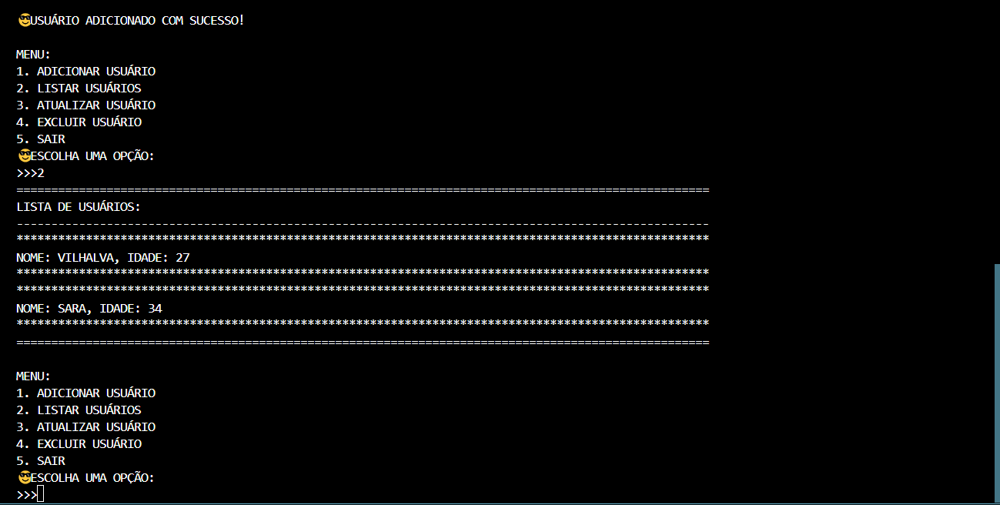
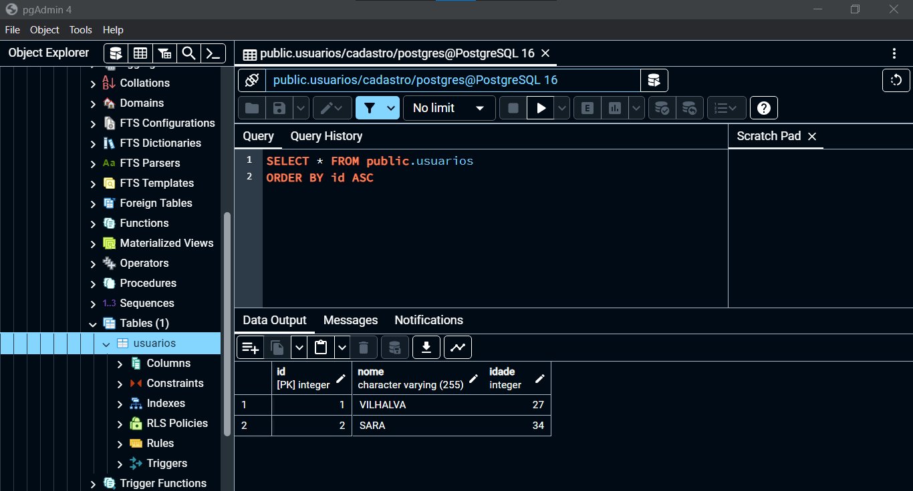

# CRUD PYTHON EM POSTGRESQL
🎈GERENCIE O NOME E IDADE DOS USUÁRIOS NO DATABASE POSTGRESQL.

 <br>
 <br>

## DESCRIÇÃO:
Este aplicativo é um gerenciador de usuários que permite adicionar, listar, atualizar e excluir informações de usuários armazenadas em um banco de dados POSTGRESQL CRUD. Ele foi projetado para fornecer uma interface simples e interativa para manipular os dados dos usuários.

Funcionalidades principais:

1. **Adicionar Usuário**: Permite adicionar um novo usuário ao banco de dados, fornecendo o nome e a idade do mesmo.

2. **Listar Usuários**: Apresenta uma lista de todos os usuários cadastrados no banco de dados, mostrando seus nomes e idades.

3. **Atualizar Usuário**: Permite atualizar as informações de um usuário existente no banco de dados, substituindo o nome e/ou a idade pelo novo valor fornecido.

4. **Excluir Usuário**: Remove um usuário específico do banco de dados com base no nome fornecido.

O aplicativo fornece um menu intuitivo para o usuário interagir com essas funcionalidades. Ele utiliza a linguagem de programação Python e o conector POSTGRESQL para estabelecer a conexão com o banco de dados e executar as operações de manipulação de dados.

## EXECUTANDO O PROJETO:
### 1. Importando o Banco de Dados:
   - Antes de executar o aplicativo, importe o arquivo `DATABASE.sql` fornecido. 

### 2. Configurando a Conexão com o PostgreSQL:
   - Abra o arquivo `CODIGO.py` e localize a seção onde a conexão com o banco de dados é configurada. Você precisará inserir suas credenciais de conexão neste trecho de código:
   ```python
   host='localhost',
   database='cadastro',
   user='seu_usuario',
   password='sua_senha'
   ```

### 3. Instalando Pacotes Python:
   - Certifique-se de ter o pacote `psycopg2` instalado. Caso contrário, você pode instalá-lo com o comando:
   ```bash
   pip install psycopg2
   ```

### 4. Executando o Aplicativo:
   - Após configurar o banco de dados e as credenciais de conexão, execute o script `CODIGO.py`. Isso iniciará o aplicativo Python que permite adicionar, listar, atualizar e excluir usuários do banco de dados `cadastro`.

## NÃO SABE?
- Entendemos que para manipular arquivos em muitas linguagens, é necessário possuir conhecimento nessas áreas. Para auxiliar nesse aprendizado, oferecemos cursos gratuitos disponíveis:
* [CURSO DE PYTHON](https://github.com/VILHALVA/CURSO-DE-PYTHON)
* [CURSO DE POSTGRESQL](https://github.com/VILHALVA/CURSO-DE-POSTGRESQL)
* [CONFIRA MAIS CURSOS](https://github.com/VILHALVA?tab=repositories&q=+topic:CURSO)

## CREDITOS:
- [PROJETO CRIADO PELO VILHALVA](https://github.com/VILHALVA)
- [PROJETO BASEADO NO "CRUD PYTHON EM MYSQL"](https://github.com/VILHALVA/CRUD-PYTHON-EM-MYSQL)

